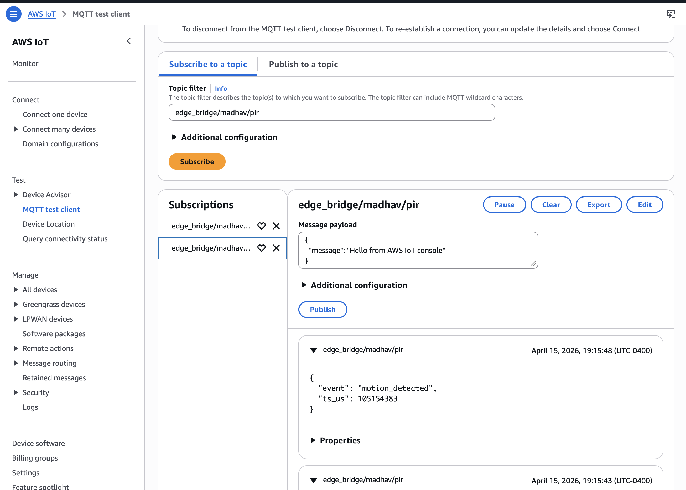
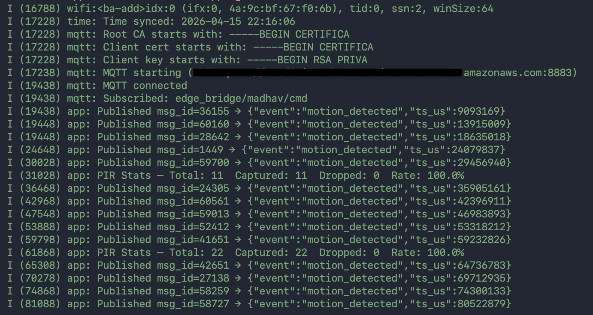
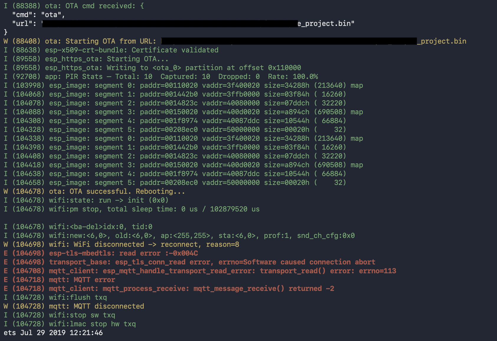
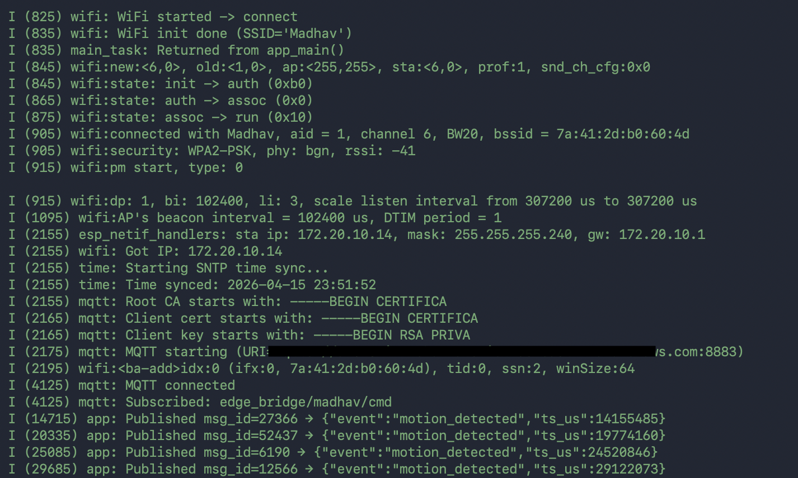
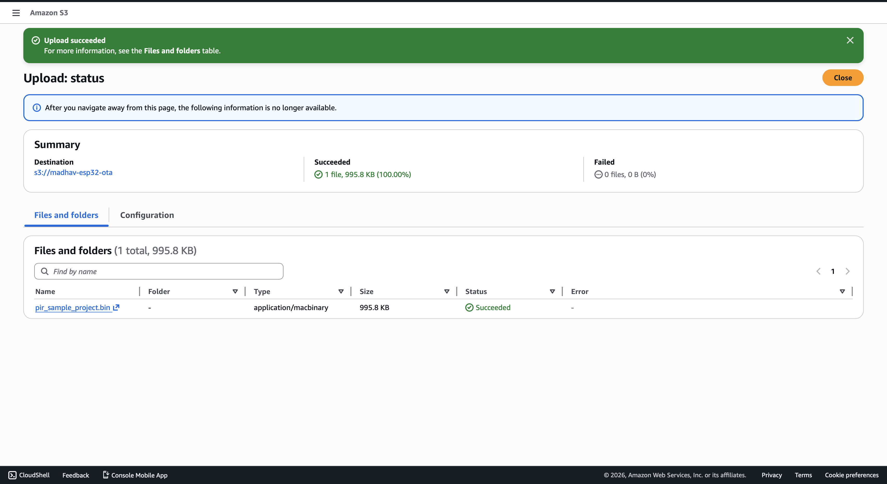

# The_ESP32_Sentinel
### Edge to Cloud IoT Motion Detection Firmware

ESP32 Sentinel is firmware that acts as middleware between physical hardware and the cloud, bridging a PIR motion sensor on an ESP32 microcontroller to AWS IoT Core over a secure, authenticated MQTT connection. 
Every time motion detected, a timestamped JSON event travels from a hardware interrupt through a FreeRTOS task queue, across a mutually authenticated TLS connection and into AWS IoT Core in real time. The device also supports remote firmware updates triggered entirely from the cloud, with automatic rollback if the update fails.

## Hardware 
LED triggers in real time whem PIR sensor detects motion 


| Component     | Pin    | Notes                        |
|---------------|--------|------------------------------|
| PIR Sensor    | GPIO 4 | HC-SR501, 3.3V or 5V VCC    |
| Onboard LED   | GPIO 2 | Mirrors PIR state            |
| GND           | GND    | Shared between ESP32 and PIR |

## System Architecture
 
```
PIR Sensor (GPIO 4)
      │
      │  Hardware interrupt fires on motion
      ▼
IRAM_ATTR ISR
      │  Timestamps event, posts to queue automically
      ▼
16-deep ISR-safe FreeRTOS Queue
      │  Decouples interrupt from network I/O
      ▼
comm_task (FreeRTOS Task)
      │  Waits for WiFi + MQTT connectivity
      │  Formats JSON payload
      ▼
AWS IoT Core (MQTT over TLS 1.2, port 8883)
      │
      ├──▶  Real-time monitoring (MQTT Test Client)
      └──▶  OTA command channel (cloud → device)
                  │
                  ▼
            OTA Task (dedicated)
            Downloads firmware from S3
            Flashes new partition
            Reboots → rollback if unhealthy
```

## Live Demo
 

Real motion events arriving in AWS IoT Core MQTT Test Client
 

Boot sequence, MQTT connection, motion publishing, and PIR diagnostics
 
## OTA in Action
 

Firmware downloading from AWS S3, written to flash — PIR still publishing during download
 

Device reboots, reconnects to WiFi, resyncs time, reconnects to AWS — fully autonomous
 

995.8KB firmware binary hosted on S3, downloaded over HTTPS during OTA

## Project Structure
 
```
main/
├── app_main.c       Entry point — wires all modules together
├── app_config.h     All configurable constants (WiFi, MQTT, GPIO)
├── pir.c / .h       GPIO ISR, FreeRTOS queue, diagnostic counters
├── wifi.c / .h      WiFi STA manager with auto-reconnect
├── mqtt.c / .h      MQTT client with mutual TLS for AWS IoT Core
├── time_sync.c / .h SNTP time synchronization
├── ota.c / .h       HTTPS OTA update with rollback protection
├── certs/           AWS IoT certificates (not committed — see certs/README.md)
└── docs/            Screenshots and documentation
```
